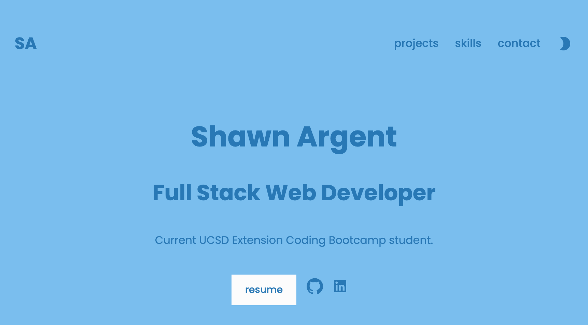

# React Professional Portfolio

## Table of Contents

- [Description](#description)
- [Installation](#installation)
- [Usage](#usage)
- [Screenshot](#screenshot)
- [Deployment](#deployment)
- [Tech](#tech)
- [License](#license)
- [Contact](#contact)

## Description

Professional portfolio project developed for the UCSD Coding Bootcamp and built with Reactjs.

## Installation

Runs in browser.

## Usage 

npm start from command line, launches browser. 

## Screenshot

## Deployment

(https://shawnargent.github.io/react-portfolio/)
## Tech

Reactjs
Material UI

## License

MIT

## Testing

none

## Contact:

ShawnArgent (https://github.com/ShawnArgent)  
 kshawn001@gmail.com